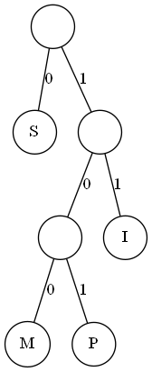
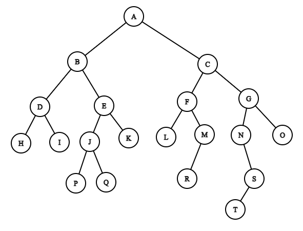
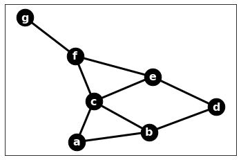

# CSE 280 Prove 7

(c) BYU-Idaho - It is an honor code violation to post this
file completed or uncompleted in a public file sharing site.

**Instructions**: Answer each question using proper markdown notation as needed.  Use the preview view in Visual Studio Code (or another editor if desired) to see the formatting, tables, and mathematical formula properly rendered.  If you need to write code, then first test your code in a separate file and then copy the code into this document using code fences. 

**Name**:

**Section**:

**Teacher**:

## Question 1 (10 points)

Using the encoding tree below, encode the word "MISSISSIPPI".

Answer: 

## Question 2 (5 points)

Referring back to Question 1, how many bits smaller is the encoded value of "MISSISSIPPI" from that of the original string value?  Recall that each unecoded letter is 8 bits and each 1 or 0 in the encoding is 1 bit.

Answer: 

## Question 3 (15 points)

Identify the pre-order and post-order traversal for the tree below.  Your answer to each should be comma separated list (in proper order) of the letters A through T.

|Traversal Type|Traversal|
|:-:|:-:|
|Pre-Order||
|Post-Order||

## Question 4 (20 points)

Identify the Depth First Search tree and the Breadth First Search tree for the graph below.  Your answer should be a comma separated list of tuples showing each of the edges in the Tree.  For example, to represent a path between $c$ and $d$ going through $e$ the representation would be $(c,e), (e,d)$.  Start your traversal from vertex $a$ for both types.  There may be multiple correct answers.

|Traversal Type|Traversal|
|:-:|:-:|
|Depth First Search Tree||
|Breadth First Search Tree||

